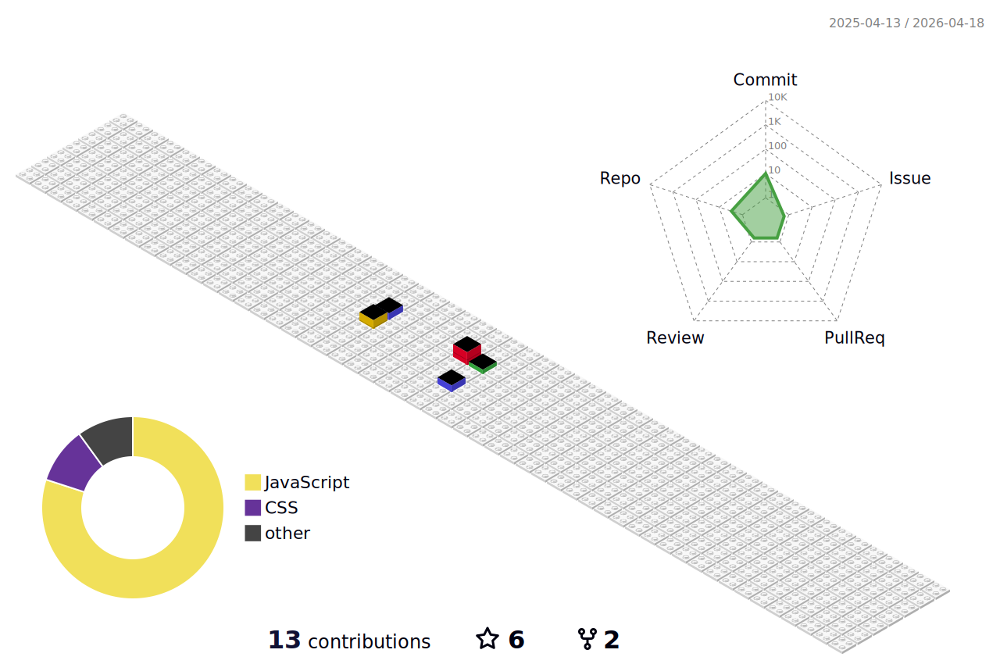

<h2> Hi, I'm Claudio Tassis (Cl4ud10 T4551S) </h2>

<p><em>English Teacher at <a href="https://www.salesianos.br/unidade/colegio-salesiano-jardim-camburi">Salesiano</a></br>Learning to code at <a href="https://www.alura.com.br/">Alura</a> 
</em></p>

[](https://twitter.com/Cl4ud10_BR)
[](https://www.linkedin.com/in/claudio-tassis-6256b843/)
[](https://github.com/claudiotassis)


###  A little more about me...  

```javascript
const Cl4ud10 = {
  pronouns: "He" | "Him",
  code: [Javascript, Typescript, HTML, CSS, Ruby, Python, Java],
  tools: [React, Redux, Node, Storybook, Styled-Components, Jest, Docker],
  architecture: ["microservices", "event-driven", "design system pattern"],
  techCommunities: {
                        coorganizer: "Brazilian",
                        speaker: "Portuguese && English",
                        mentor: "Alura"
                      },
 challenge: "I am focused on studying and becoming a coder"
}
```

 <em><b>I love connecting with different people</b> so if you want to say <b>hi, I'll be happy to meet you more!</b> :)</em>

---



<!--
**claudiotassis/claudiotassis** is a ✨ _special_ ✨ repository because its `README.md` (this file) appears on your GitHub profile.

Here are some ideas to get you started:

- 🔭 I’m currently working on ...
- 🌱 I’m currently learning ...
- 👯 I’m looking to collaborate on ...
- 🤔 I’m looking for help with ...
- 💬 Ask me about ...
- 📫 How to reach me: ...
- 😄 Pronouns: ...
- ⚡ Fun fact: ...
-->
