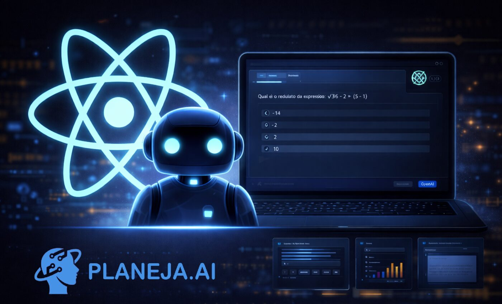
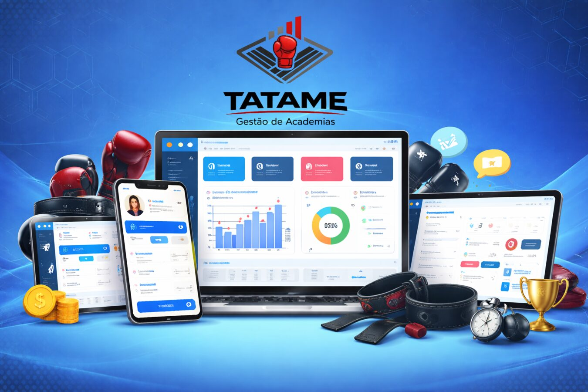
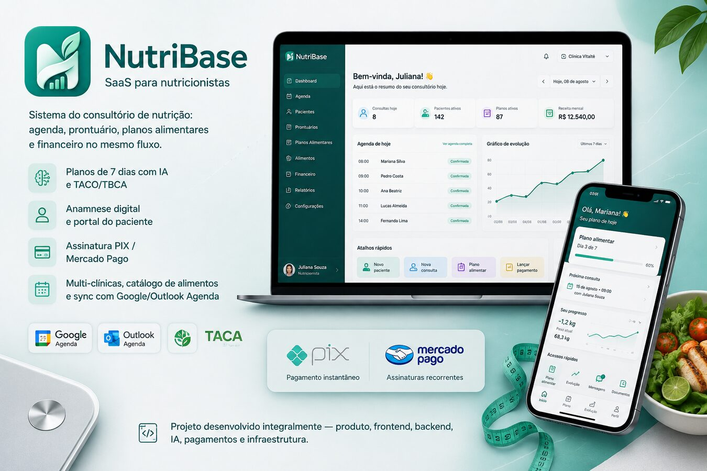
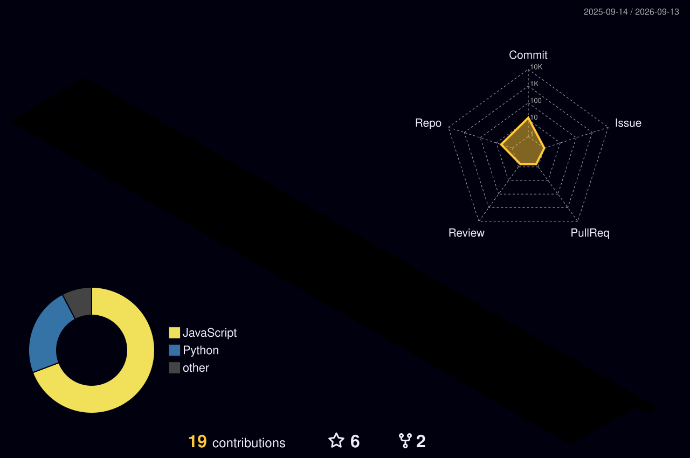
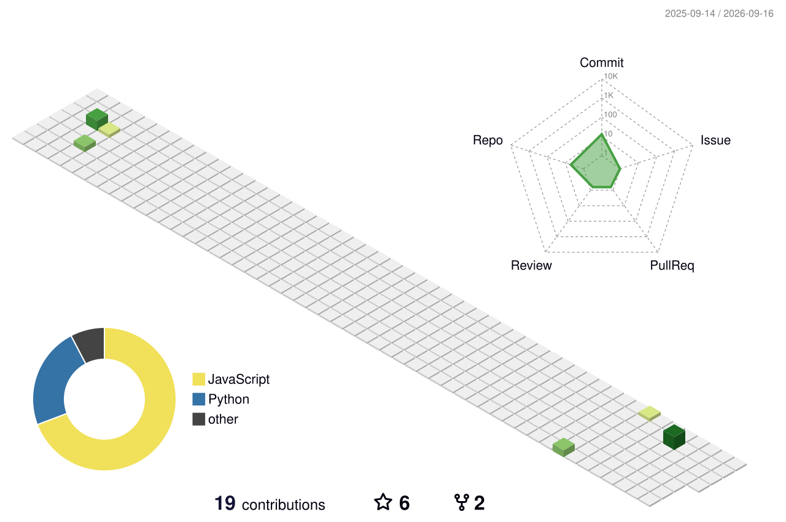
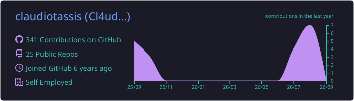
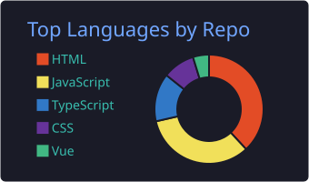
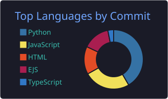
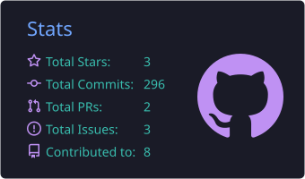
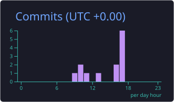

<div align="center">
  <a href="https://claudiotassis.github.io">
    
  </a>
</div>

<div align="center">
  <a href="https://claudiotassis.github.io">
    
  </a>
</div>

<div align="center">

[](https://claudiotassis.github.io)
[](https://barcodelabs.com.br/)
[](https://www.linkedin.com/in/claudio-tassis/)
[](https://github.com/claudiotassis)

</div>


## About

Fundador da **[BarCode Labs](https://barcodelabs.com.br/)** em Vitória, ES. Professor de inglês e engenheiro full stack — produto, frontend, backend, apps mobile e infraestrutura. Código artesanal, SaaS em produção.

Pai do Benjamin · marido da Andressa.

```js
const claudio = {
  studio: "BarCode Labs",
  role: ["Founder", "Full Stack Engineer"],
  location: "Vitória · ES · Brazil",
  shipping: ["Planeja.ai", "Tatame", "NutriBase", "TeachersHub", "Fisio360"],
  stack: ["TypeScript", "React", "Next.js", "NestJS", "Flutter", "OpenAI"],
  languages: ["pt-BR", "en"],
  ping: "claudiotassis@gmail.com",
};
```


## Portfolio · BarCode Labs

Produtos construídos de ponta a ponta. Demo 3D: **[claudiotassis.github.io](https://claudiotassis.github.io)**

<table>
  <tr>
    <td width="50%">
      <a href="https://planeja.ai">
        
      </a>
      <h3><a href="https://planeja.ai">PLANEJA.AI</a></h3>
      <p>SaaS educacional · questões com IA, correção de redações, Pix / Mercado Pago.<br/>
      <code>React · Express · Python · MySQL · OpenAI</code></p>
    </td>
    <td width="50%">
      <a href="https://www.tatame.website">
        
      </a>
      <h3><a href="https://www.tatame.website">TATAME</a></h3>
      <p>SaaS de academias · painel web + app nativo Android/iOS.<br/>
      <code>React · TypeScript · Flutter · Node.js · MySQL</code></p>
    </td>
  </tr>
  <tr>
    <td width="50%">
      <a href="https://www.nutribase.fit">
        
      </a>
      <h3><a href="https://www.nutribase.fit">NutriBase</a></h3>
      <p>SaaS para nutricionistas · agenda, prontuário, planos TACO + IA.<br/>
      <code>React · NestJS · Prisma · Tailwind · OpenAI</code></p>
    </td>
    <td width="50%">
      <a href="https://www.teachershub.website">
        
      </a>
      <h3><a href="https://www.teachershub.website">TeachersHub</a></h3>
      <p>SaaS para professores de inglês · aulas com IA e sala ao vivo.<br/>
      <code>React · NestJS · MySQL · OpenAI · Socket.io</code></p>
    </td>
  </tr>
  <tr>
    <td width="50%">
      <a href="https://www.fisio360.website">
        
      </a>
      <h3><a href="https://www.fisio360.website">Fisio360</a></h3>
      <p>SaaS para clínicas de fisioterapia · agenda, mapa do corpo, financeiro.<br/>
      <code>React · NestJS · Prisma · Tailwind</code></p>
    </td>
    <td width="50%">
      <a href="https://barcodelabs.com.br/#portfolio">
        
      </a>
      <h3><a href="https://barcodelabs.com.br/#portfolio">M/A Manutenção &amp; Metrologia</a></h3>
      <p>Site institucional B2B · landing de conversão e captação de orçamentos.<br/>
      <code>Next.js · TypeScript · Tailwind · Framer Motion</code></p>
    </td>
  </tr>
</table>


## Stack

<p align="center">
  
</p>
<p align="center">
  
</p>


## 3D contribution world

<div align="center">
  
  
</div>

<div align="center">
  <picture>
    <source media="(prefers-color-scheme: dark)" srcset="./output/github-snake-dark.svg" />
    <source media="(prefers-color-scheme: light)" srcset="./output/github-snake.svg" />
    
  </picture>
</div>

## Stats

<div align="center">
  
  
</div>

<div align="center">
  
</div>

<div align="center">
  
</div>

<div align="center">
  
</div>

<details>
<summary>Profile cards</summary>

<br/>







</details>

---

<div align="center">
  <a href="https://claudiotassis.github.io">Enter the 3D world</a> ·
  <a href="https://barcodelabs.com.br/">BarCode Labs</a> ·
  <a href="https://www.linkedin.com/in/claudio-tassis/">LinkedIn</a> ·
  <a href="mailto:claudiotassis@gmail.com">claudiotassis@gmail.com</a>
</div>
