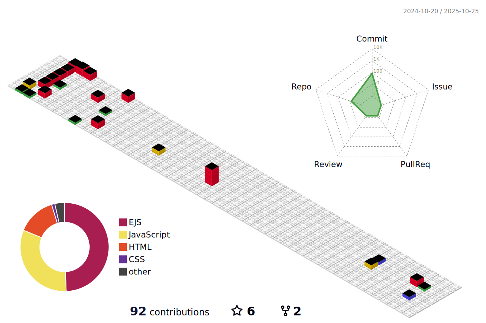

### Table of Contents 

* [🙋About Me](#about-me)
     
* [📊My Contribuitions Calendar](#my-contribuitions-calendar)
     
* [⚙️Tools](#tools)
     
* [Post-Job Briefing](https://github.com/hillaryfraley/jobbriefings#job-briefing)  
     - [Post-Job Briefing Requirements](https://github.com/hillaryfraley/jobbriefings#job-briefing-requirements)
     - [Post-Job Briefing Documentation](https://github.com/hillaryfraley/jobbriefings#job-briefing-documentation)

[References](https://github.com/hillaryfraley/jobbriefings#references)
 
* [Laws and Regulations](https://github.com/hillaryfraley/jobbriefings#laws-and-regulations)
* [Technical Information](https://github.com/hillaryfraley/jobbriefings#technical-information)
* [Related Work Practices](https://github.com/hillaryfraley/jobbriefings#related-work-practices)
* [Related Documents and Forms](https://github.com/hillaryfraley/jobbriefings#related-documents-and-forms)


<br />
<br />

## 🙋About Me
<h2> Hi, I'm Claudio Tassis (Cl4ud10 T4551S) </h2>

<p><em>English Teacher at <a href="https://www.salesianos.br/unidade/colegio-salesiano-jardim-camburi">Salesiano</a></br>Learning to code at <a href="https://www.alura.com.br/">Alura</a> 
</em></p>


[](https://twitter.com/Cl4ud10_BR)
[](https://www.linkedin.com/in/claudio-tassis-6256b843/)
[](https://github.com/claudiotassis)


```javascript
const Cl4ud10 = {
  pronouns: "He" | "Him",
  profession: "English Teacher,
  code: [Javascript, HTML, CSS, PHP],
  tools: [VsCode, Figma, Node.Js, GitHub], 
  askMeAbout: ["web dev", "tech", "app dev", "music", "english teaching/learning", "beer and bbq"],
  softSkills: [resilience, custumer-driven, organization and time management, conflicts mediation, public speaking, critical thinking, group work],
  techCommunities: {
                        coorganizer: "Brazilian",
                        speaker: "Portuguese && English",
                        mentor: "Alura"
                      },
 challenge: "I am focused on studying and becoming a coder"
    print("Thanks for dropping by, hope you find some of my work interesting.")
}
```


 <em><b>I love connecting with different people, so if you want to say hi, I'll be happy to meet you more!</b> :)</em>


<br />
<br />


---
---

<br />
<br />

## 📊My Contribuitions Calendar


<br />
<br />

---
---

<br />
<br />

## ⚙Tools

<br />

## 😄 Social Media
[](https://www.discordapp.com/users/CLAUDIO%20TASSIS#3857)
[](https://www.instagram.com/claudio.tassis/)
[](https://twitter.com/Cl4ud10_BR)
[](https://www.linkedin.com/in/claudio-tassis-6256b843/)
[](https://www.https://github.com/claudiotassis)


---


## 👨‍🎓 Learning
[](https://www.javascript.com/)
[](https://www.typescriptlang.org/)
[](https://www.https://github.com/claudiotassis)
[](https://code.visualstudio.com/)
[](https://www.python.org/)
[](https://www.mysql.com/)
[](https://angular.io/)

[](https://dev.java/)
[](https://angular.io/)
[](https://nodejs.org/en/)
[](https://pt-br.reactjs.org/)
[](https://www.figma.com/)


---


## 💬 Previously worked with
[](https://angular.io/)
[](https://angular.io/)
[](https://www.lua.org/)


---
---

<br />
<br />


```
```
## 📈 Stats
---
[](https://github.com/vn7n24fzkq/github-profile-summary-cards)
[](https://github.com/vn7n24fzkq/github-profile-summary-cards) [](https://github.com/vn7n24fzkq/github-profile-summary-cards)
[](https://github.com/vn7n24fzkq/github-profile-summary-cards) [](https://github.com/vn7n24fzkq/github-profile-summary-cards)

---

 


[](https://github.com/claudiotassis/github-profile-trophy)

<!--


